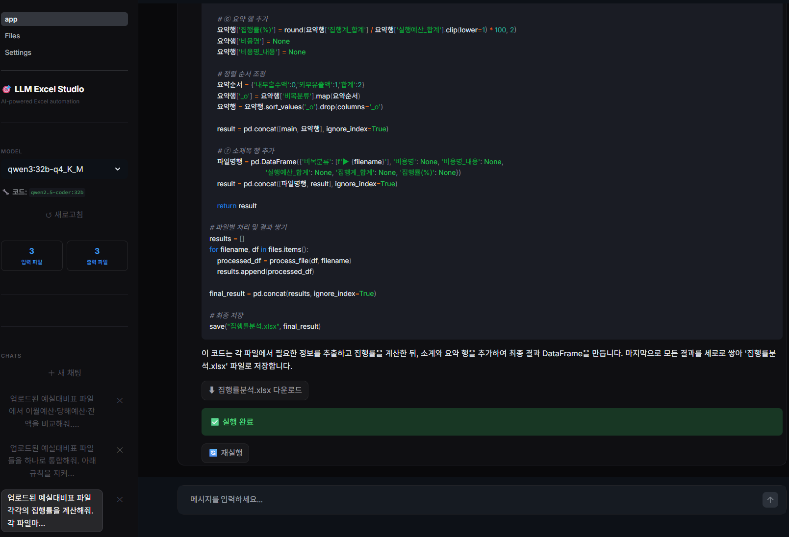
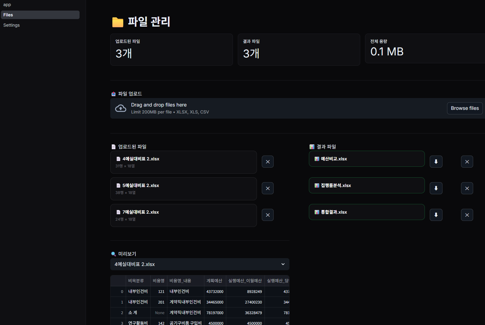
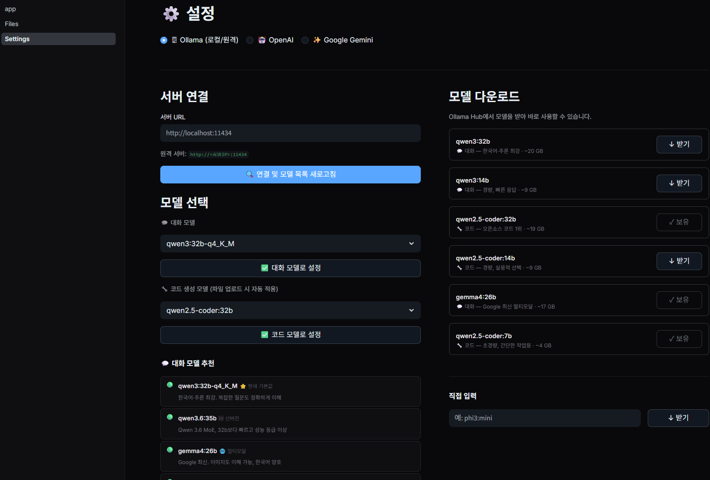
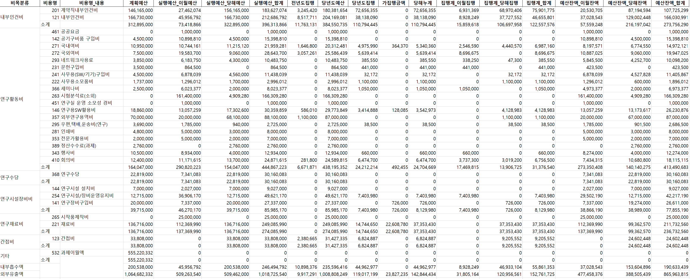
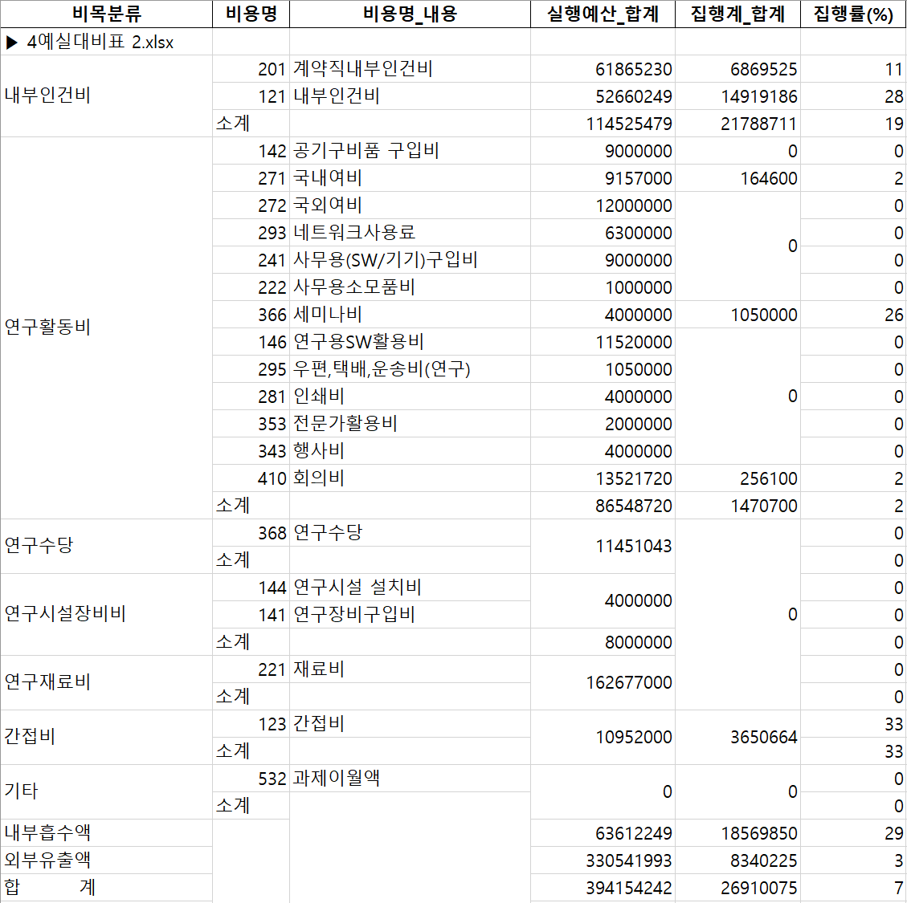
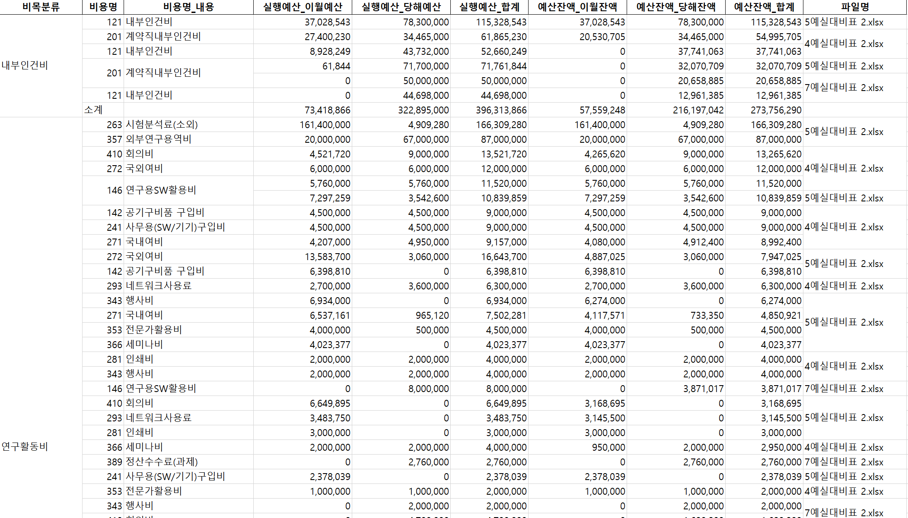

# 🎯 LLM Excel Studio

> Streamlit 기반 AI 엑셀 자동화 스튜디오 — 다중 LLM 지원, 자연어 프롬프트로 파일 병합·분석·처리

**Basic Software Technology** 과제 구현물

### 🌐 서비스 접속 → `http://xxxx-ev1.xxxx:33002`
### 📋 시스템 소개 → `http://xxxx-ev1.xxxx:33002/About`

---

## 스크린샷








---

## 주요 기능

| 기능 | 설명 |
|------|------|
| 💬 **자연어 채팅** | 자연어로 엑셀 파일 분석·병합·처리 요청 |
| 🤖 **다중 AI 모델** | Ollama (로컬/원격) · OpenAI · Google Gemini |
| 🔀 **스마트 모델 라우팅** | 질문 키워드 분석 후 대화 모델 / 코드 생성 모델 자동 전환 |
| 📁 **파일 관리** | Excel/CSV 업로드·미리보기·삭제, 결과 다운로드 |
| 🔁 **자동 재시도 + 코드 공개** | 실패 시 AI가 최대 5회 자동 수정·재실행, 수정된 코드 채팅창에 표시 |
| 💬 **채팅 히스토리** | 대화 목록 저장·복원, 앱 재시작 후에도 유지 |
| 🔒 **샌드박스 실행** | AST 검증 후 격리 실행, 위험 모듈 차단 |
| 💾 **Excel 자동 포맷** | 천단위 콤마, 컬럼 너비 자동 조정, 셀 병합 복원 |
| 📥 **모델 다운로드 UI** | Ollama Hub에서 앱 안에서 직접 모델 다운로드 |
| 🧪 **Playground** | 인터랙티브 코드 직접 실행, 채팅에서 원클릭으로 코드 전송 |

---

## 예실대비표 전용 기능

| 버튼 | 기능 |
|------|------|
| 📂 **파일 통합** | 여러 파일을 비목분류 순서 유지하며 합산 통합, 소계·요약행 자동 생성 |
| 📊 **집행률 분석** | 파일별 비목별 집행률(%) 계산, 파일명 소제목으로 구분 출력 |
| 🔍 **예산 비교** | 이월·당해 예산 비교, 잔액 큰 순 정렬, 파일명 컬럼 포함 |

---

## 로컬 설치 및 실행

```bash
git clone https://github.com/<your-username>/llm-excel-studio.git
cd llm-excel-studio
pip install -r requirements.txt

# Ollama 로컬 모델 사용 시
ollama pull qwen3:32b      # 대화 모델 (권장)
ollama pull qwen2.5-coder:32b  # 코드 생성 모델 (권장)

streamlit run app.py
# → http://localhost:8501
```

---

## 서버 배포 (백그라운드 실행)

```bash
chmod +x scripts/run.sh scripts/stop.sh
./scripts/run.sh           # 기본 포트 8501
./scripts/run.sh 8080      # 포트 지정

tail -f logs/streamlit.log   # 로그 확인
./scripts/stop.sh            # 종료
```

- 파일 수정 시 **자동 새로고침** (hot-reload)
- `0.0.0.0` 바인딩 → 포트포워딩으로 외부 접속 가능

---

## AI 모델 설정

앱 실행 후 **⚙️ Settings** 또는 사이드바에서 설정합니다.

| 제공자 | 설정 방법 |
|--------|----------|
| **Ollama** | 서버 URL → 사이드바에서 모델 선택 (자동 로드) |
| **OpenAI** | API Key + 모델 선택 |
| **Gemini** | API Key + 모델 선택 |

- **대화 모델**: 일반 대화·설명용 (기본: `qwen3:32b`)
- **코드 생성 모델**: "합산", "분석", "정렬" 등 데이터 처리 키워드 감지 시 자동 전환 (기본: `qwen2.5-coder:32b`)

> **보안**: API Key는 UI에서만 입력하세요. 코드에 절대 넣지 마세요.

---

## 프로젝트 구조

```
llm-excel-studio/
├── app.py                  # 메인 채팅 페이지
├── pages/
│   ├── 1_Files.py          # 파일 관리
│   ├── 2_Settings.py       # 모델 설정 및 다운로드
│   ├── 3_About.py          # 시스템 소개
│   └── 4_Playground.py     # 인터랙티브 코드 실행 환경
├── core/
│   ├── llm/                # Ollama · OpenAI · Gemini 클라이언트 + 듀얼 라우팅
│   ├── prompt/             # 시스템 프롬프트 생성
│   ├── executor/           # AST 샌드박스 + 자동 재시도
│   └── files/              # 파일 I/O · 병합셀 전처리 · 채팅 히스토리
├── scripts/                # run.sh / stop.sh
└── requirements.txt
```
